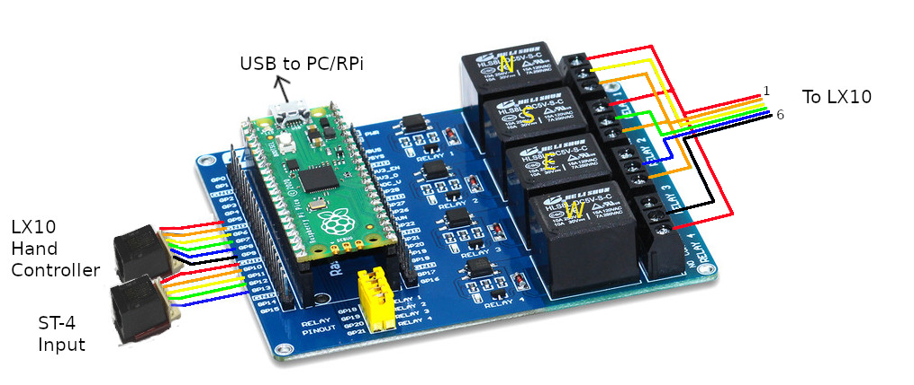

# RPi-Pico-Autoguider

Warning: Please be careful when interfacing to your telescope. I cannot be responsible for any damage caused due to errors either due to your wiring etc or this software. I have tested this on my LX10.

This interface goes between a Windows PC or a Raspberry Pi and a telescope. It decodes Meade LX200 ASCII serial commands and through suitable relays or opto isolaters can control various telescopes. Details are given for controlling a Meade LX10 or a ST-4 connection.
 
The Pico can also be controlled by a PC using software such as PHD2, or a Raspberry Pi with suitable software such as my Pi_Autoguider.

Please take care when interfacing your telescope. At your own risk.

## 

